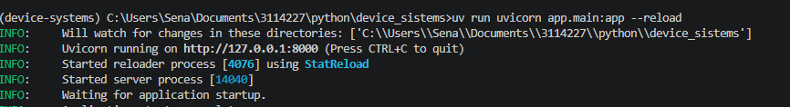
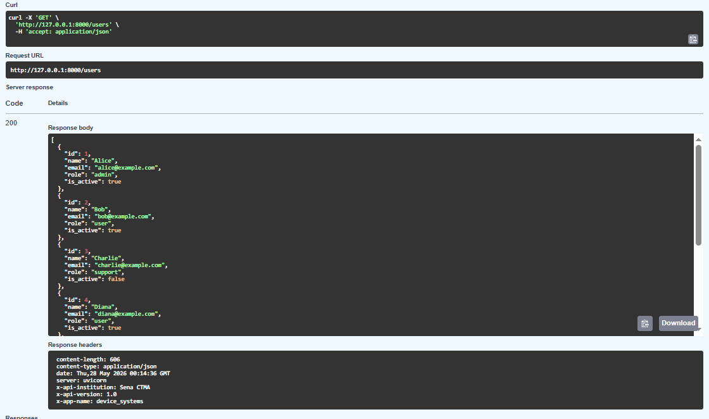
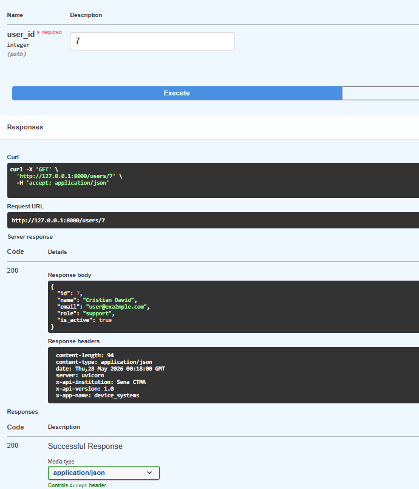
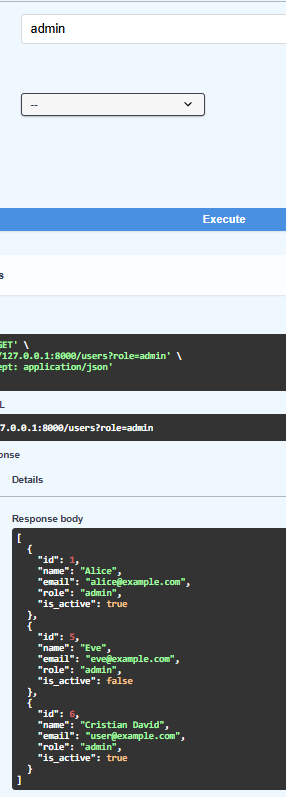
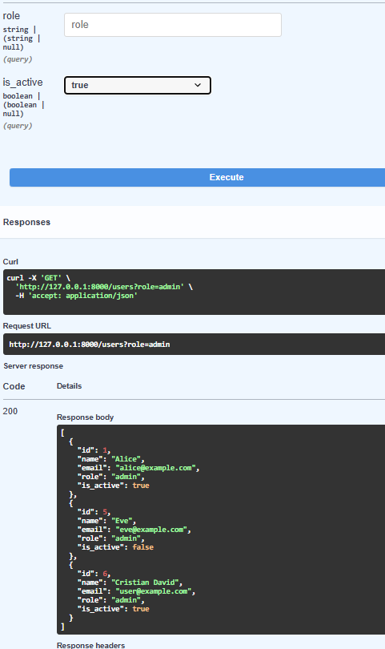
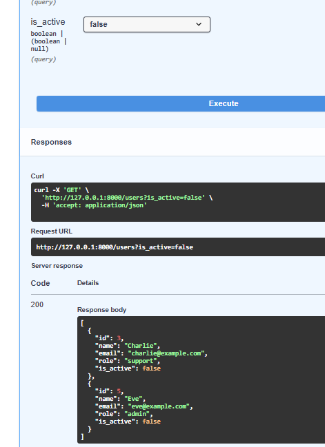
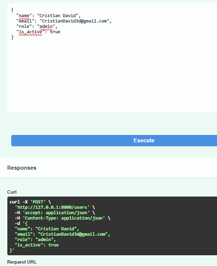
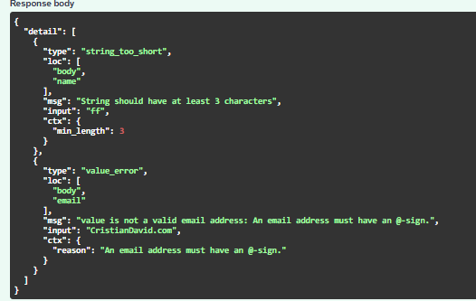
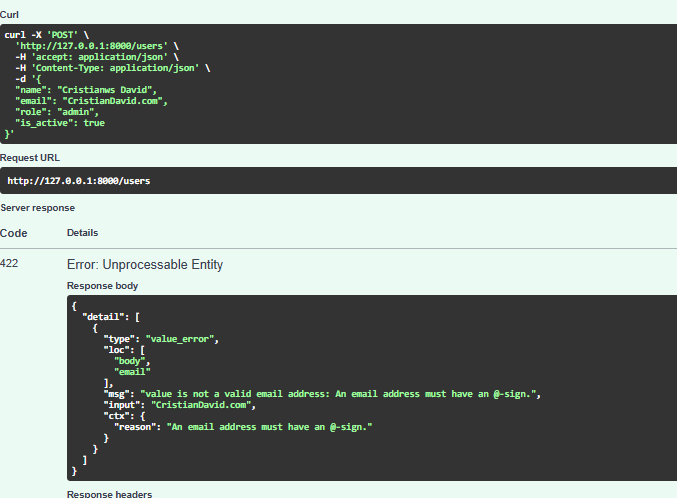
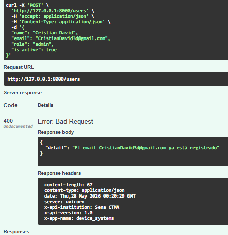

# Device Systems API

## Descripción de la aplicación
API REST para gestión de usuarios construida con FastAPI y Pydantic v2.
Permite crear usuarios, listarlos, filtrarlos por rol y estado activo, y obtenerlos por ID.

## Instalación de dependencias

```bash
# Inicializar el proyecto
uv init

# Agregar dependencias
uv add fastapi uvicorn pydantic[email]

# Sincronizar dependencias
uv sync
```

## Ejecución del servidor
```bash
uv run uvicorn app.main:app --reload
```
Servidor en http://127.0.0.1:8000 — Swagger en http://127.0.0.1:8000/docs

## Tabla de endpoints
| Método | Ruta | Descripción |
|--------|------|-------------|
| GET | /users | Lista todos los usuarios (filtros opcionales: ?role=, ?is_active=) |
| GET | /users/{user_id} | Obtiene un usuario por ID |
| POST | /users | Crea un nuevo usuario |

## Ejemplos de peticiones GET y POST
```bash
# POST - Crear usuario
curl -X POST http://127.0.0.1:8000/users \
  -H "Content-Type: application/json" \
  -d "{\"name\":\"Juan\",\"email\":\"juan@example.com\",\"role\":\"admin\",\"is_active\":true}"

# GET - Listar todos
curl http://127.0.0.1:8000/users

# GET - Filtrar por rol
curl "http://127.0.0.1:8000/users?role=admin"

# GET - Filtrar por activos
curl "http://127.0.0.1:8000/users?is_active=true"

# GET - Por ID
curl http://127.0.0.1:8000/users/1
```

## Reflexión final

A lo largo de este proyecto se comprendió cómo FastAPI estructura una API REST: desde la definición de modelos con Pydantic, el ruteo de endpoints, la validación automática de datos, hasta los response models que controlan qué se expone al cliente. También se exploró el filtrado por query params, el manejo de errores con HTTPException, y cómo Swagger UI documenta todo sin configuración adicional.

## Capturas de evidencia

### Pruebas exitosas
| Captura | Descripción |
|---------|-------------|
|  | Servidor ejecutándose correctamente |
|  | GET /users — lista todos los usuarios |
|  | GET /users/1 — obtiene usuario por ID |
|  | GET /users?role=admin — filtra por rol |
|  | GET /users?is_active=true — filtra usuarios activos |
|  | GET /users?is_active=false — filtra usuarios inactivos |
|  | POST /users — creación exitosa de usuario |

### Errores y validaciones
| Captura | Descripción |
|---------|-------------|
|  | POST /users — validación: nombre demasiado corto (< 3 caracteres) |
|  | POST /users — validación: correo electrónico inválido o vacío |
|  | POST /users — error 400: email ya registrado |
