# Device Systems API

## Descripción de la aplicación
API REST para la gestión de usuarios, dispositivos y préstamos construida con **FastAPI**, **SQLAlchemy**, **Pydantic v2** y **Alembic**.
Permite crear, listar, filtrar, actualizar y eliminar usuarios y dispositivos, gestionar préstamos con validación de disponibilidad, y consultar información relacionada mediante joins. La persistencia es en SQLite con migraciones controladas mediante Alembic.

## Tecnologías utilizadas
- **Python 3.10+**
- **FastAPI** — Framework web para construir APIs
- **Pydantic v2** — Validación de datos con `EmailStr` y `Field`
- **SQLAlchemy** — ORM para la base de datos SQLite
- **Alembic** — Migraciones de base de datos
- **Uvicorn** — Servidor ASGI para ejecutar la aplicación
- **uv** — Gestor de dependencias y entornos virtuales

## Instalación de dependencias

```bash
# Opción 1 — con uv (recomendado)
uv sync

# Opción 2 — con pip y requirements.txt
pip install -r requirements.txt
```

## Ejecución del servidor
```bash
uv run uvicorn app.main:app --reload
```
Servidor en http://127.0.0.1:8000 — Swagger en http://127.0.0.1:8000/docs

## Tabla de endpoints

### Users
| Método | Ruta | Descripción | Código |
|--------|------|-------------|--------|
| GET | /users | Lista todos los usuarios (filtros: ?role=, ?is_active=) | 200 |
| GET | /users/{user_id} | Obtiene un usuario por ID | 200 |
| POST | /users | Crea un nuevo usuario | 201 |
| PUT | /users/{user_id} | Actualiza completamente un usuario | 200 |
| PATCH | /users/{user_id} | Actualiza parcialmente un usuario | 200 |
| DELETE | /users/{user_id} | Elimina un usuario | 200 |

### Devices
| Método | Ruta | Descripción | Código |
|--------|------|-------------|--------|
| GET | /devices | Lista todos los dispositivos (filtros: ?device_type=, ?is_available=, ?brand=, ?search=) | 200 |
| GET | /devices/{device_id} | Obtiene un dispositivo por ID | 200 |
| POST | /devices | Crea un nuevo dispositivo | 201 |
| PUT | /devices/{device_id} | Actualiza completamente un dispositivo | 200 |
| PATCH | /devices/{device_id} | Actualiza parcialmente un dispositivo | 200 |
| DELETE | /devices/{device_id} | Elimina un dispositivo | 204 |

### Loans
| Método | Ruta | Descripción | Código |
|--------|------|-------------|--------|
| GET | /loans | Lista todos los préstamos (filtros: ?status=, ?user_email=, ?device_type=) | 200 |
| GET | /loans/details | Lista préstamos con información de usuario y dispositivo | 200 |
| GET | /loans/{loan_id} | Obtiene un préstamo por ID | 200 |
| POST | /loans | Crea un nuevo préstamo (valida disponibilidad) | 201 |
| PATCH | /loans/{loan_id}/return | Devuelve un dispositivo y lo marca disponible | 200 |
| GET | /users/{user_id}/loans | Consulta préstamos de un usuario | 200 |
| GET | /devices/{device_id}/loans | Consulta historial de préstamos de un dispositivo | 200 |

## Códigos de estado usados
| Código | Significado | Cuándo ocurre |
|--------|-------------|---------------|
| 200 | OK | Respuestas exitosas de GET, PUT, PATCH, DELETE y devolución |
| 201 | Created | Creación exitosa de usuario, dispositivo o préstamo |
| 204 | No Content | Eliminación exitosa de dispositivo |
| 400 | Bad Request | Email o número de serie duplicado, PATCH sin campos |
| 403 | Forbidden | API Key inválida o ausente |
| 404 | Not Found | Usuario, dispositivo o préstamo no encontrado |
| 409 | Conflict | Dispositivo no disponible, préstamo ya devuelto |
| 422 | Unprocessable Entity | Datos inválidos según validaciones de Pydantic |

## Estructura del proyecto

```
device_systems/
│── app/
│ │── main.py                            # Punto de entrada de FastAPI
│ │
│ │── database/
│ │ │── connection.py                    # Configuración SQLAlchemy y sesión
│ │
│ │── models/
│ │ │── user_model.py                    # Modelo User
│ │ │── device_model.py                  # Modelo Device
│ │ │── loan_model.py                    # Modelo Loan
│ │
│ │── schemas/
│ │ │── user_schema.py                   # Schemas Pydantic de User
│ │ │── device_schema.py                 # Schemas Pydantic de Device
│ │ │── loan_schema.py                   # Schemas Pydantic de Loan
│ │
│ │── routes/
│ │ │── user_routes.py                   # Endpoints de Users
│ │ │── device_routes.py                 # Endpoints de Devices
│ │ │── loan_routes.py                   # Endpoints de Loans
│ │
│ │── services/
│ │ │── user_services.py                 # Lógica de negocio de Users
│ │ │── device_service.py                # Lógica de negocio de Devices
│ │ │── loan_service.py                  # Lógica de negocio de Loans
│ │
│ │── dependencies/
│ │ │── user_dependencies.py             # Dependencias: get_user_or_404, verify_api_key
│ │ │── database_dependency.py           # Dependencia de base de datos
│
│── alembic/
│ │── versions/                          # Migraciones generadas
│ │── env.py                             # Configuración de Alembic
│
│── alembic.ini                          # Configuración de Alembic
│── device_systems.db                    # Base de datos SQLite
│── requirements.txt
│── README.md
```

El proyecto sigue una arquitectura en capas:
- **database/** → conexión y sesión de SQLAlchemy con SQLite
- **models/** → modelos ORM que mapean las tablas `users`, `devices` y `loans`
- **schemas/** → validación de datos de entrada/salida con Pydantic
- **services/** → lógica de negocio con operaciones CRUD contra la BD
- **dependencies/** → dependencias reutilizables con `Depends()`
- **routes/** → endpoints que conectan requests con services

## Migraciones con Alembic

Alembic es una herramienta de migraciones para SQLAlchemy que permite versionar los cambios en el esquema de la base de datos.

### Inicialización
```bash
alembic init alembic
```
Esto crea la carpeta `alembic/` con los archivos de configuración necesarios.

### Configuración
En `alembic/env.py` se importan todos los modelos y se configura `target_metadata` para que Alembic detecte automáticamente los cambios:
```python
from app.database import Base
from app.models import user_model, device_model, loan_model
target_metadata = Base.metadata
```

### Generar migración
```bash
alembic revision --autogenerate -m "create devices and loans tables"
```
Alembic compara el estado actual de la base de datos con los modelos definidos y genera automáticamente el código de la migración.

### Aplicar migración
```bash
alembic upgrade head
```

### Consultar historial
```bash
alembic history
```

### Ver estado actual
```bash
alembic current
```

## Modelos y relaciones

### Modelo User
| Campo | Tipo | Restricción |
|-------|------|-------------|
| id | Integer | Primary Key |
| name | String | Obligatorio |
| email | String | Único y obligatorio |
| role | String | Obligatorio (admin, support, user) |
| is_active | Boolean | Default True |

### Modelo Device
| Campo | Tipo | Restricción |
|-------|------|-------------|
| id | Integer | Primary Key |
| name | String | Obligatorio |
| serial_number | String | Único y obligatorio |
| device_type | String | Obligatorio (laptop, tablet, proyector, cámara, router, monitor) |
| brand | String | Opcional |
| is_available | Boolean | Default True |
| created_at | DateTime | Fecha de creación |

### Modelo Loan
| Campo | Tipo | Restricción |
|-------|------|-------------|
| id | Integer | Primary Key |
| user_id | Integer | Foreign Key a users.id |
| device_id | Integer | Foreign Key a devices.id |
| loan_date | DateTime | Fecha de préstamo |
| return_date | DateTime | Opcional |
| status | String | active, returned, overdue |

### Asociaciones entre modelos

Las relaciones se implementan con `relationship()` y `back_populates`:

- **User → Loan**: Un usuario puede tener muchos préstamos.
- **Device → Loan**: Un dispositivo puede aparecer en muchos préstamos históricos.
- **Loan → User y Device**: Cada préstamo pertenece a un usuario y a un dispositivo.

```python
class User(Base):
    __tablename__ = "users"
    loans = relationship("Loan", back_populates="user")

class Device(Base):
    __tablename__ = "devices"
    loans = relationship("Loan", back_populates="device")

class Loan(Base):
    __tablename__ = "loans"
    user = relationship("User", back_populates="loans")
    device = relationship("Device", back_populates="loans")
```

## Consultas avanzadas con joins y filtros

### Joins
Para obtener préstamos con información del usuario y del dispositivo se usa `joinedload()`:
```python
db.query(Loan).options(joinedload(Loan.user), joinedload(Loan.device)).all()
```

### Filtros combinados
Los endpoints aceptan múltiples filtros opcionales usando `and_` / `or_`:
```python
# Búsqueda textual con OR
query.filter(or_(Device.name.ilike(f"%{search}%"), Device.serial_number.ilike(f"%{search}%")))

# Filtro por email con JOIN
query.join(User).filter(User.email.ilike(f"%{user_email}%"))

# Filtro por tipo de dispositivo con JOIN
query.join(Device).filter(Device.device_type == device_type)
```

### Filtros disponibles
| Recurso | Filtros |
|---------|---------|
| GET /users | ?role=admin, ?is_active=true |
| GET /devices | ?device_type=laptop, ?is_available=true, ?brand=lenovo, ?search=thinkpad |
| GET /loans | ?status=active, ?user_email=correo, ?device_type=laptop |

## Dependency Injection con Depends()

`Depends()` es un mecanismo de **inyección de dependencias** de FastAPI. Permite extraer lógica reutilizable (validaciones, autenticación, recursos) fuera de los endpoints.

### Implementación en el proyecto

Se implementaron dependencias en `app/dependencies/user_dependencies.py`:

```python
def get_user_or_404(user_id: int, db: Session = Depends(get_db)):
    """Obtiene usuario por ID o lanza 404 si no existe."""
    return us.get_user_by_id(db, user_id)

def verify_api_key(x_api_key: str = Header(...)):
    """Valida API Key en el header X-API-Key."""
    if x_api_key != "contraseña":
        raise HTTPException(403, detail="API Key inválida. Usa 'contraseña'")
    return x_api_key
```

### ¿Cómo se usan?

**`verify_api_key`** se aplica a nivel de **router** — todos los endpoints la ejecutan automáticamente:
```python
router = APIRouter(tags=["users"], dependencies=[Depends(verify_api_key)])
```

**`get_user_or_404`** se aplica a nivel de **endpoint** — inyecta el resultado directamente:
```python
@router.get("/users/{user_id}")
def get_user(user: dict = Depends(get_user_or_404)):
    return user
```

### Flujo de validación en cadena
```
Request → ¿Header X-API-Key?
              │
              ▼
   1. verify_api_key (router)
      ├─ ¿Falta el header?       → 422 (FastAPI)
      ├─ ¿Key incorrecta?        → 403
      └─ ¿Key correcta?          → pasa
              │
              ▼
   2. get_user_or_404 (endpoint)
      ├─ Ejecuta get_db()        → abre sesión SQLAlchemy
      ├─ ¿Usuario existe?        → inyecta el objeto User
      └─ ¿No existe?             → 404
              │
              ▼
   3. Ejecuta el endpoint — cierra sesión automáticamente
```

## Manejo de errores

El proyecto maneja errores en dos capas:

### 1. Validación automática (422 — Pydantic)
FastAPI valida los datos de entrada automáticamente según los modelos de Pydantic. Si un campo no cumple las reglas, devuelve un error **422 Unprocessable Entity**.

### 2. Errores de negocio (HTTPException)
Los errores relacionados con la lógica de la aplicación se lanzan manualmente desde los servicios:

| Excepción | Causa |
|-----------|-------|
| 400 | Email o número de serie duplicado, PATCH sin campos |
| 404 | Usuario, dispositivo o préstamo no encontrado |
| 409 | Dispositivo no disponible, préstamo ya devuelto |

## Ejemplos de peticiones

### POST — Crear dispositivo
```bash
curl -X POST http://127.0.0.1:8000/devices \
  -H "Content-Type: application/json" \
  -H "X-API-Key: contraseña" \
  -d "{\"name\":\"Laptop Lenovo ThinkPad\",\"serial_number\":\"LEN-2024-001\",\"device_type\":\"laptop\",\"brand\":\"Lenovo\"}"
```

### POST — Crear préstamo
```bash
curl -X POST http://127.0.0.1:8000/loans \
  -H "Content-Type: application/json" \
  -H "X-API-Key: contraseña" \
  -d "{\"user_id\":1,\"device_id\":1}"
```

### PATCH — Devolver dispositivo
```bash
curl -X PATCH http://127.0.0.1:8000/loans/1/return \
  -H "X-API-Key: contraseña"
```

### GET — Préstamos con detalles
```bash
curl -H "X-API-Key: contraseña" http://127.0.0.1:8000/loans/details
```

### GET — Filtrar préstamos por estado
```bash
curl -H "X-API-Key: contraseña" "http://127.0.0.1:8000/loans?status=active"
```

### GET — Préstamos de un usuario
```bash
curl -H "X-API-Key: contraseña" http://127.0.0.1:8000/users/1/loans
```

### GET — Historial de préstamos de un dispositivo
```bash
curl -H "X-API-Key: contraseña" http://127.0.0.1:8000/devices/1/loans
```

## Capturas de evidencia

### Migraciones con Alembic
| Captura | Descripción |
|---------|-------------|
| 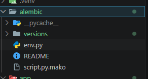 | Estructura de la carpeta alembic después de inicializar |
| 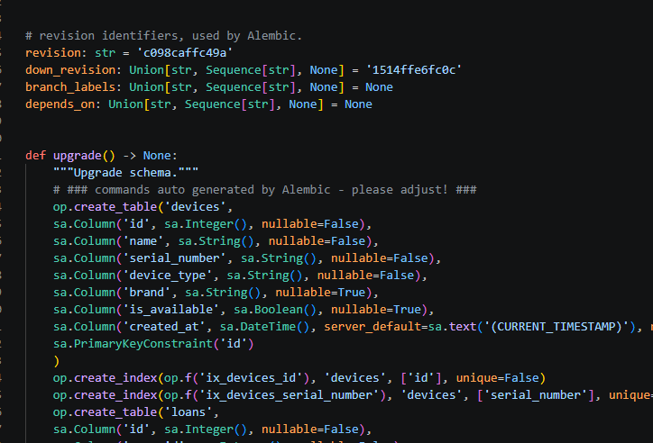 | Migración generada con autogenerate para crear tablas devices y loans |
| 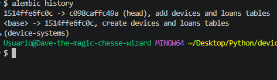 | Historial de migraciones con alembic history |
| 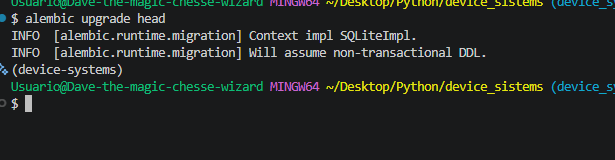 | Ejecución de alembic upgrade head |
| 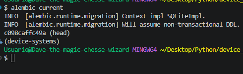 | Estado actual de la base de datos con alembic current |
| 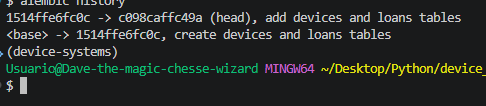 | Historial de migraciones de Alembic |
| 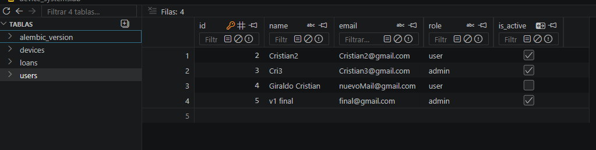 | Tablas users, devices y loans creadas en la base de datos |

### Evidencia Swagger
| Captura | Descripción |
|---------|-------------|
| 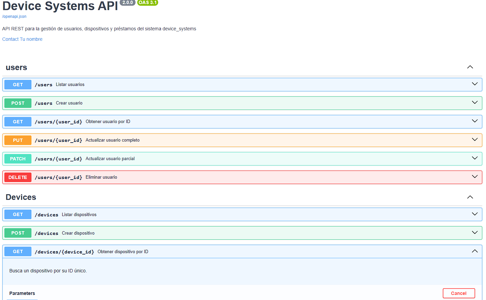 | Documentación interactiva de la API en Swagger UI |

### Pruebas funcionales
| Captura | Descripción |
|---------|-------------|
| 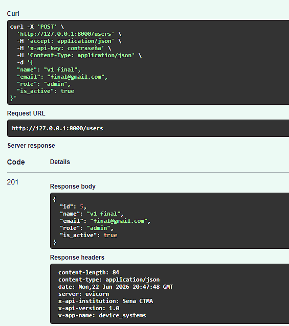 | POST /users — Creación exitosa de usuario |
| 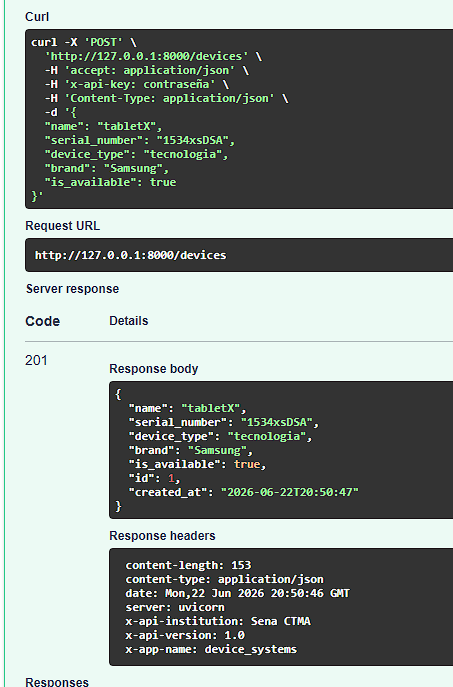 | POST /devices — Creación exitosa de dispositivo |
| 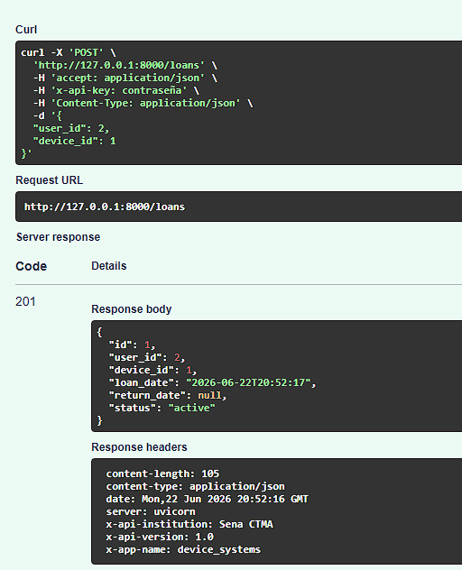 | POST /loans — Creación exitosa de préstamo |
| 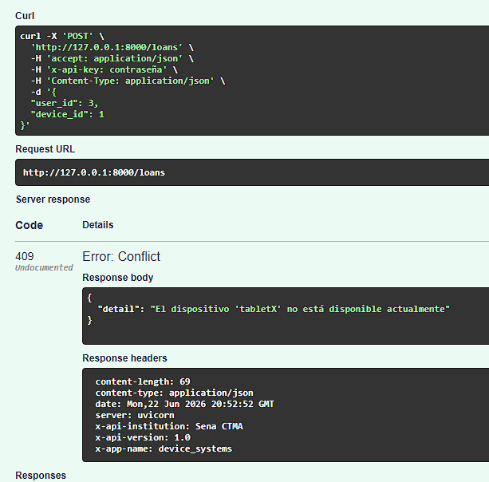 | POST /loans — Error 409 al intentar prestar un dispositivo no disponible |
| 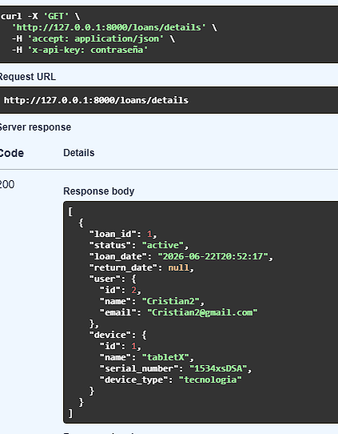 | GET /loans/details — Préstamos con información de usuario y dispositivo |
| 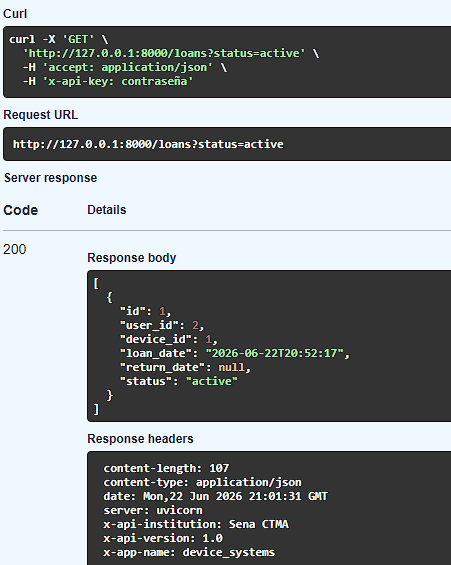 | GET /loans?status=active — Filtro de préstamos por estado activo |
| 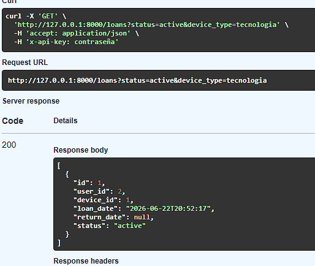 | GET /loans?device_type=laptop — Filtro de préstamos por tipo de dispositivo |
| 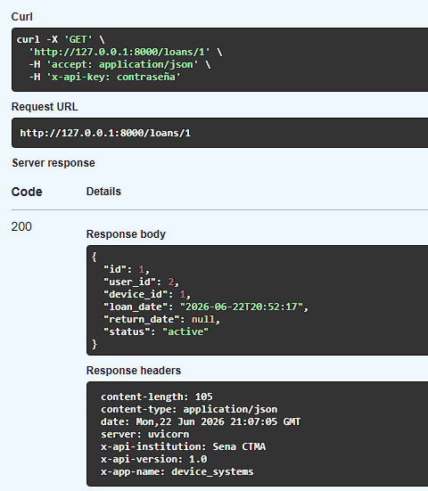 | GET /users/{id}/loans — Consulta de préstamos de un usuario específico |
| 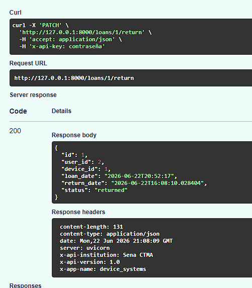 | PATCH /loans/{id}/return — Devolución exitosa de dispositivo |
| 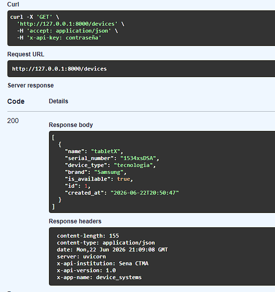 | GET /devices/{id} — Dispositivo vuelve a estar disponible después de la devolución |
| 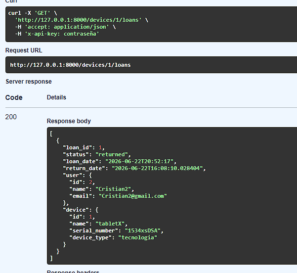 | GET /devices/{id}/loans — Historial de préstamos del dispositivo |
| 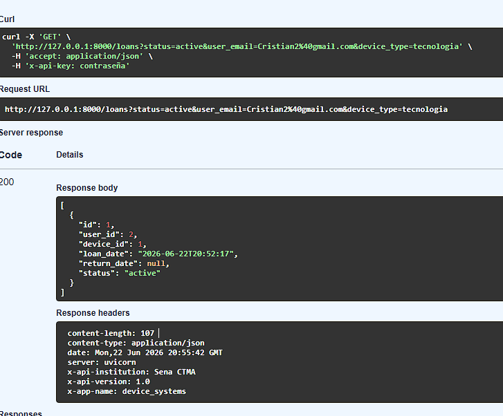 | GET /loans?device_type=laptop — Filtro de préstamos por tipo de dispositivo |

---

## Reflexión sobre la importancia de migraciones, relaciones y consultas avanzadas

### Migraciones con Alembic
La implementación de migraciones con Alembic permitió versionar y controlar los cambios en el esquema de la base de datos de forma ordenada y reproducible. En lugar de modificar las tablas manualmente o depender de `create_all()` en cada ejecución, Alembic genera un historial de migraciones que puede aplicarse, revertirse y compartirse entre desarrolladores. Esto es fundamental en entornos de trabajo colaborativo y en despliegues a producción, donde el esquema de la base de datos debe evolucionar de manera controlada sin perder datos existentes.

### Relaciones entre modelos
Las relaciones definidas con `relationship()` y `back_populates` entre User, Device y Loan permitieron modelar la lógica de negocio real: un usuario puede tener múltiples préstamos, un dispositivo puede tener un historial de préstamos, y cada préstamo conecta a un usuario con un dispositivo. Esta estructura relacional evita la redundancia de datos, mantiene la integridad referencial mediante claves foráneas, y facilita la navegación entre objetos relacionados desde el código sin necesidad de escribir consultas SQL complejas manualmente.

### Consultas avanzadas
El uso de `join()`, `ilike()`, `or_()` y filtros combinados permitió construir endpoints flexibles que responden a necesidades reales de consulta: listar préstamos con información del usuario y dispositivo en una sola llamada, buscar dispositivos por marca o texto libre, y filtrar préstamos por múltiples criterios simultáneamente. Estas consultas demuestran la potencia de SQLAlchemy como ORM y cómo abstrae la complejidad del SQL subyacente sin perder capacidad de expresividad.

En conjunto, migraciones, relaciones y consultas avanzadas forman la base de una API robusta, mantenible y preparada para evolucionar según los requisitos del negocio.
