# Device Systems API

## Descripción de la aplicación
API REST para la gestión de usuarios, dispositivos y préstamos construida con **FastAPI**, **SQLAlchemy**, **Pydantic v2** y **Alembic**.
Implementa autenticación JWT con OAuth2 Bearer token, control de acceso por roles (admin, support, user), rate limiting, middleware de trazabilidad y protección CORS.

## Tecnologías utilizadas
- **Python 3.10+**
- **FastAPI** — Framework web para construir APIs
- **Pydantic v2** — Validación de datos con `EmailStr` y `Field`
- **SQLAlchemy** — ORM para la base de datos SQLite
- **Alembic** — Migraciones de base de datos
- **Uvicorn** — Servidor ASGI para ejecutar la aplicación
- **uv** — Gestor de dependencias y entornos virtuales
- **passlib + bcrypt** — Hash de contraseñas
- **python-jose** — Generación y validación de tokens JWT
- **slowapi** — Rate limiting
- **python-dotenv** — Configuración por variables de entorno

## Instalación de dependencias

```bash
# Opción 1 — con uv (recomendado)
uv sync

# Opción 2 — con pip y requirements.txt
pip install -r requirements.txt
```

## Ejecución del servidor
```bash
uv run uvicorn app.main:app --reload
```
Servidor en http://127.0.0.1:8000 — Swagger en http://127.0.0.1:8000/docs

## Tabla de endpoints

### Auth
| Método | Ruta | Descripción | Código |
|--------|------|-------------|--------|
| POST | /auth/register | Registra un nuevo usuario (validación de contraseña) | 201 |
| POST | /auth/login | Inicia sesión y devuelve un token JWT | 200 |
| GET | /auth/me | Obtiene los datos del usuario autenticado | 200 |

### Users
| Método | Ruta | Descripción | Rol requerido | Código |
|--------|------|-------------|---------------|--------|
| GET | /users | Lista todos los usuarios (filtros: ?role=, ?is_active=) | auth | 200 |
| GET | /users/{user_id} | Obtiene un usuario por ID | auth | 200 |
| POST | /users | Crea un nuevo usuario | auth | 201 |
| PUT | /users/{user_id} | Actualiza completamente un usuario | auth | 200 |
| PATCH | /users/{user_id} | Actualiza parcialmente un usuario | auth | 200 |
| DELETE | /users/{user_id} | Elimina un usuario | auth | 200 |

### Devices
| Método | Ruta | Descripción | Rol requerido | Código |
|--------|------|-------------|---------------|--------|
| GET | /devices | Lista todos los dispositivos (filtros: ?device_type=, ?is_available=, ?brand=, ?search=) | auth | 200 |
| GET | /devices/{device_id} | Obtiene un dispositivo por ID | auth | 200 |
| POST | /devices | Crea un nuevo dispositivo | admin/support | 201 |
| PUT | /devices/{device_id} | Actualiza completamente un dispositivo | admin/support | 200 |
| PATCH | /devices/{device_id} | Actualiza parcialmente un dispositivo | admin/support | 200 |
| DELETE | /devices/{device_id} | Elimina un dispositivo | admin | 204 |

### Loans
| Método | Ruta | Descripción | Rol requerido | Código |
|--------|------|-------------|---------------|--------|
| GET | /loans | Lista todos los préstamos (filtros: ?status=, ?user_email=, ?device_type=) | auth | 200 |
| GET | /loans/details | Lista préstamos con información de usuario y dispositivo | admin/support | 200 |
| GET | /loans/{loan_id} | Obtiene un préstamo por ID | auth | 200 |
| POST | /loans | Crea un nuevo préstamo (valida disponibilidad) | auth | 201 |
| PATCH | /loans/{loan_id}/return | Devuelve un dispositivo y lo marca disponible | admin/support | 200 |
| GET | /users/{user_id}/loans | Consulta préstamos de un usuario | auth | 200 |
| GET | /devices/{device_id}/loans | Consulta historial de préstamos de un dispositivo | auth | 200 |

## Códigos de estado usados
| Código | Significado | Cuándo ocurre |
|--------|-------------|---------------|
| 200 | OK | Respuestas exitosas de GET, PUT, PATCH, DELETE y devolución |
| 201 | Created | Creación exitosa de usuario, dispositivo o préstamo |
| 204 | No Content | Eliminación exitosa de dispositivo |
| 400 | Bad Request | Email o número de serie duplicado, PATCH sin campos |
| 401 | Unauthorized | Token inválido, expirado o ausente |
| 403 | Forbidden | API Key inválida o rol sin permisos |
| 404 | Not Found | Usuario, dispositivo o préstamo no encontrado |
| 409 | Conflict | Dispositivo no disponible, préstamo ya devuelto |
| 422 | Unprocessable Entity | Datos inválidos según validaciones de Pydantic |
| 429 | Too Many Requests | Límite de peticiones excedido (rate limiting) |

## Estructura del proyecto

```
device_systems/
│── app/
│ │── main.py                            # Punto de entrada de FastAPI
│ │
│ │── auth/
│ │ │── security.py                      # Hash, verificación y JWT
│ │
│ │── database/
│ │ │── connection.py                    # Configuración SQLAlchemy y sesión
│ │
│ │── models/
│ │ │── user_model.py                    # Modelo User (con hashed_password, role, is_active)
│ │ │── device_model.py                  # Modelo Device
│ │ │── loan_model.py                    # Modelo Loan
│ │
│ │── schemas/
│ │ │── auth_schema.py                   # Schemas Pydantic de Auth (UserRegister, UserLogin, Token)
│ │ │── user_schema.py                   # Schemas Pydantic de User
│ │ │── device_schema.py                 # Schemas Pydantic de Device
│ │ │── loan_schema.py                   # Schemas Pydantic de Loan
│ │
│ │── routes/
│ │ │── auth_routes.py                   # Endpoints de autenticación (register, login, me)
│ │ │── user_routes.py                   # Endpoints de Users
│ │ │── device_routes.py                 # Endpoints de Devices
│ │ │── loan_routes.py                   # Endpoints de Loans
│ │
│ │── services/
│ │ │── auth_service.py                  # Lógica de negocio de autenticación
│ │ │── user_services.py                 # Lógica de negocio de Users
│ │ │── device_service.py                # Lógica de negocio de Devices
│ │ │── loan_service.py                  # Lógica de negocio de Loans
│ │
│ │── dependencies/
│ │ │── auth_dependency.py               # Dependencias: get_current_user, require_admin, etc.
│ │ │── user_dependencies.py             # Dependencias: get_user_or_404, verify_api_key
│ │ │── rate_limit.py                    # Configuración de SlowAPI
│ │
│ │── middleware/
│ │ │── request_middleware.py            # Middleware de trazabilidad (X-Request-ID, etc.)
│ │
│── alembic/
│ │── versions/                          # Migraciones generadas
│ │── env.py                             # Configuración de Alembic
│
│── alembic.ini                          # Configuración de Alembic
│── device_systems.db                    # Base de datos SQLite
│── requirements.txt
│── README.md
```

El proyecto sigue una arquitectura en capas:
- **auth/** → seguridad: hash de contraseñas y tokens JWT
- **database/** → conexión y sesión de SQLAlchemy con SQLite
- **models/** → modelos ORM que mapean las tablas `users`, `devices` y `loans`
- **schemas/** → validación de datos de entrada/salida con Pydantic
- **services/** → lógica de negocio con operaciones CRUD contra la BD
- **dependencies/** → dependencias reutilizables con `Depends()` y `Security()`
- **middleware/** → middleware personalizado de trazabilidad
- **routes/** → endpoints que conectan requests con services

## Migraciones con Alembic

Alembic es una herramienta de migraciones para SQLAlchemy que permite versionar los cambios en el esquema de la base de datos.

### Inicialización
```bash
alembic init alembic
```
Esto crea la carpeta `alembic/` con los archivos de configuración necesarios.

### Configuración
En `alembic/env.py` se importan todos los modelos y se configura `target_metadata` para que Alembic detecte automáticamente los cambios:
```python
from app.database import Base
from app.models import user_model, device_model, loan_model
target_metadata = Base.metadata
```

### Generar migración
```bash
alembic revision --autogenerate -m "descripcion del cambio"
```
Alembic compara el estado actual de la base de datos con los modelos definidos y genera automáticamente el código de la migración.

### Aplicar migración
```bash
alembic upgrade head
```

### Consultar historial
```bash
alembic history
```

### Ver estado actual
```bash
alembic current
```

## Modelos y relaciones

### Modelo User
| Campo | Tipo | Restricción |
|-------|------|-------------|
| id | Integer | Primary Key |
| name | String | Obligatorio |
| email | String | Único y obligatorio |
| hashed_password | String | Hash de la contraseña |
| role | String | Obligatorio (admin, support, user) |
| is_active | Boolean | Default True |

### Modelo Device
| Campo | Tipo | Restricción |
|-------|------|-------------|
| id | Integer | Primary Key |
| name | String | Obligatorio |
| serial_number | String | Único y obligatorio |
| device_type | String | Obligatorio (laptop, tablet, proyector, cámara, router, monitor) |
| brand | String | Opcional |
| is_available | Boolean | Default True |
| created_at | DateTime | Fecha de creación |

### Modelo Loan
| Campo | Tipo | Restricción |
|-------|------|-------------|
| id | Integer | Primary Key |
| user_id | Integer | Foreign Key a users.id |
| device_id | Integer | Foreign Key a devices.id |
| loan_date | DateTime | Fecha de préstamo |
| return_date | DateTime | Opcional |
| status | String | active, returned, overdue |

### Asociaciones entre modelos

Las relaciones se implementan con `relationship()` y `back_populates`:

- **User → Loan**: Un usuario puede tener muchos préstamos.
- **Device → Loan**: Un dispositivo puede aparecer en muchos préstamos históricos.
- **Loan → User y Device**: Cada préstamo pertenece a un usuario y a un dispositivo.

```python
class User(Base):
    __tablename__ = "users"
    loans = relationship("Loan", back_populates="user")

class Device(Base):
    __tablename__ = "devices"
    loans = relationship("Loan", back_populates="device")

class Loan(Base):
    __tablename__ = "loans"
    user = relationship("User", back_populates="loans")
    device = relationship("Device", back_populates="loans")
```

## Autenticación JWT

### Flujo de autenticación
1. **Registro** — `POST /auth/register` con nombre, email, contraseña y rol
2. **Login** — `POST /auth/login` con email y contraseña → devuelve `access_token`
3. **Authorize en Swagger** — Pega `Bearer <token>` en el botón Authorize para autenticar todas las peticiones
4. **Verificación** — Cada endpoint protegido valida el token automáticamente

### Seguridad de contraseñas
Las contraseñas se hashean con `passlib` + `bcrypt` antes de almacenarse. Nunca se guardan en texto plano.

### Validación de registro
- Mínimo 8 caracteres
- Al menos una mayúscula
- Al menos una minúscula
- Al menos un número
- Sin espacios

### Tokens JWT
- Contienen: `sub` (ID del usuario), `role`, `exp` (expiración)
- Duración: 60 minutos
- Firmados con clave secreta mediante HS256

### Control de acceso por roles
| Rol | Permisos |
|-----|----------|
| admin | Acceso total: CRUD usuarios, dispositivos, préstamos |
| support | Crear/editar dispositivos y préstamos. No puede eliminar |
| user | Solo lectura en users, devices y loans |

## Rate Limiting

Implementado con **SlowAPI** para proteger los endpoints contra abusos:

| Endpoint | Límite |
|----------|--------|
| POST /auth/register | 3 peticiones por minuto |
| POST /auth/login | 5 peticiones por minuto |
| GET /users | 30 peticiones por minuto |
| POST /loans | 10 peticiones por minuto |

Cuando se supera el límite, la API responde con **429 Too Many Requests**.

## Middleware de trazabilidad

El middleware personalizado `RequestLogMiddleware` añade tres cabeceras a todas las respuestas:

| Cabecera | Descripción |
|----------|-------------|
| X-Request-ID | UUID único por cada petición |
| X-Process-Time | Tiempo de procesamiento en segundos |
| X-App-Name | Identificador de la aplicación |

Estas cabeceras permiten rastrear peticiones en logs, medir rendimiento e identificar el origen de cada respuesta.

## Dependency Injection con Depends() y Security()

FastAPI proporciona `Depends()` para inyección de dependencias y `Security()` para esquemas de seguridad. Ambos permiten extraer lógica reutilizable (validaciones, autenticación, recursos) fuera de los endpoints.

### Dependencias de autenticación

En `app/dependencies/auth_dependency.py` se definen las dependencias de seguridad:

```python
security = HTTPBearer()

def get_current_user(
    credentials: HTTPAuthorizationCredentials = Security(security),
    db: Session = Depends(get_db),
):
    token = credentials.credentials
    payload = decode_access_token(token)
    # valida token, busca usuario y lo retorna

def get_current_active_user(
    current_user: User = Depends(get_current_user),
):
    if not current_user.is_active:
        raise HTTPException(status_code=403)
    return current_user

def require_admin(
    current_user: User = Depends(get_current_active_user),
):
    if current_user.role != "admin":
        raise HTTPException(status_code=403)

def require_admin_or_support(
    current_user: User = Depends(get_current_active_user),
):
    if current_user.role not in ("admin", "support"):
        raise HTTPException(status_code=403)
```

### Dependencias de usuario

En `app/dependencies/user_dependencies.py`:

```python
def get_user_or_404(user_id: int, db: Session = Depends(get_db)):
    """Obtiene usuario por ID o lanza 404 si no existe."""
    return us.get_user_by_id(db, user_id)

def verify_api_key(x_api_key: str = Header(...)):
    """Valida API Key en el header X-API-Key."""
    if x_api_key != "contraseña":
        raise HTTPException(403, detail="API Key inválida. Usa 'contraseña'")
    return x_api_key
```

### ¿Cómo se usan?

**A nivel de router** — todos los endpoints del router la ejecutan automáticamente:
```python
router = APIRouter(
    tags=["Devices"],
    dependencies=[Security(security), Depends(get_current_active_user), Depends(verify_api_key)]
)
```

**A nivel de endpoint** — inyecta el resultado en el parámetro:
```python
@router.get("/users/{user_id}")
def get_user(user: dict = Depends(get_user_or_404)):
    return user
```

### Flujo de validación en cadena
```
Request → Security(security) extrae token del header
               │
               ▼
    get_current_user
    ├─ ¿Token válido?     → obtiene usuario
    └─ ¿Inválido/expirado? → 401
               │
               ▼
    get_current_active_user
    ├─ ¿Usuario activo?   → pasa
    └─ ¿Inactivo?         → 403
               │
               ▼
    require_admin / require_admin_or_support
    ├─ ¿Rol cumple?       → pasa
    └─ ¿Rol incorrecto?   → 403
               │
               ▼
    verify_api_key
    ├─ ¿X-API-Key?        → pasa
    └─ ¿Inválida?         → 403
               │
               ▼
    Ejecuta el endpoint
```

## CORS — Cross-Origin Resource Sharing

```python
app.add_middleware(
    CORSMiddleware,
    allow_origins=["http://localhost:5173", "http://localhost:3000"],
    allow_credentials=True,
    allow_methods=["*"],
    allow_headers=["*"],
)
```

### ¿Por qué no se recomienda `["*"]` con credenciales?
La especificación CORS exige orígenes explícitos cuando `allow_credentials=True`. Usar `*` permite a cualquier sitio consumir la API, anulando la seguridad. Además, los navegadores bloquean la respuesta si hay credenciales y el origen es `*`.

## Manejo de errores

El proyecto maneja errores en dos capas:

### 1. Validación automática (422 — Pydantic)
FastAPI valida los datos de entrada automáticamente según los modelos de Pydantic. Si un campo no cumple las reglas, devuelve un error **422 Unprocessable Entity**.

### 2. Errores de negocio (HTTPException)
Los errores relacionados con la lógica de la aplicación se lanzan manualmente desde los servicios:

| Excepción | Causa |
|-----------|-------|
| 400 | Email o número de serie duplicado, PATCH sin campos |
| 401 | Token inválido, expirado o ausente |
| 403 | API Key inválida o rol sin permisos |
| 404 | Usuario, dispositivo o préstamo no encontrado |
| 409 | Dispositivo no disponible, préstamo ya devuelto |
| 429 | Límite de rate limiting excedido |

## Capturas de evidencia

### Estructura y migraciones
| # | Captura | Descripción |
|---|---------|-------------|
| 1 | 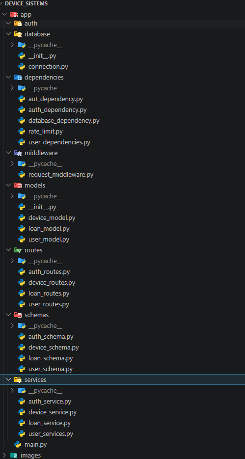 | Estructura completa del proyecto con la nueva organización |
| 2 | 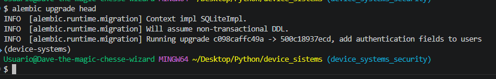 | Migración aplicada con `alembic upgrade head` |
| 3 | 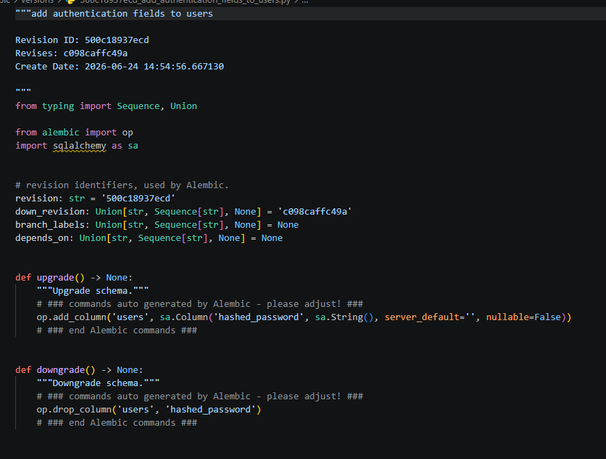 | Archivo de migración generado con autogenerate |
| 4 | 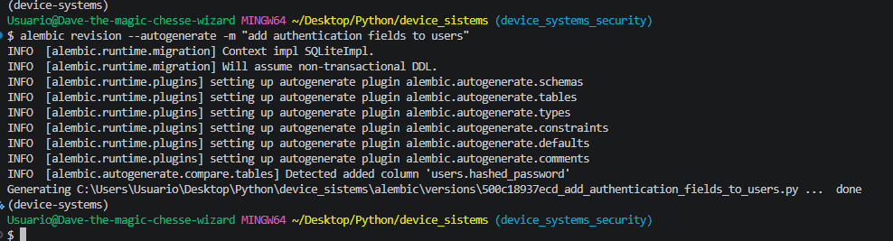 | Migración que agrega campos de autenticación a users |

### Registro y autenticación
| # | Captura | Descripción |
|---|---------|-------------|
| 5 | 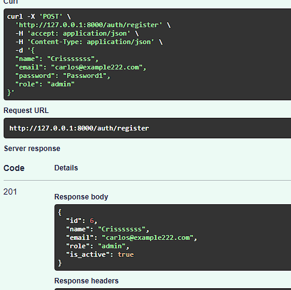 | POST /auth/register — Registro exitoso con respuesta 201 |
| 6 | 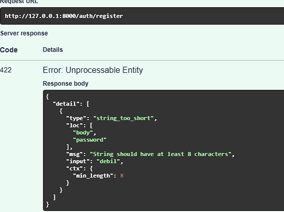 | POST /auth/register — Error 422 por contraseña que no cumple validaciones |
| 7 | 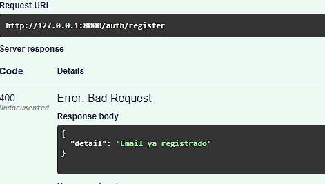 | POST /auth/register — Error 400 por email ya registrado |
| 8 | 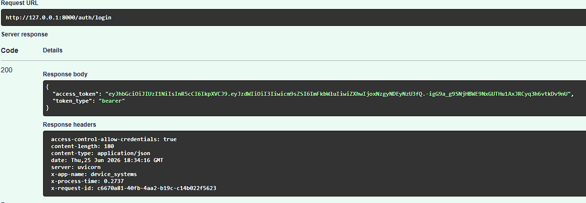 | POST /auth/login — Token JWT generado correctamente |
| 9 | 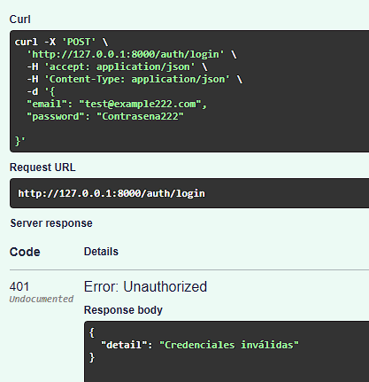 | POST /auth/login — Error 401 por contraseña incorrecta |
| 10 | 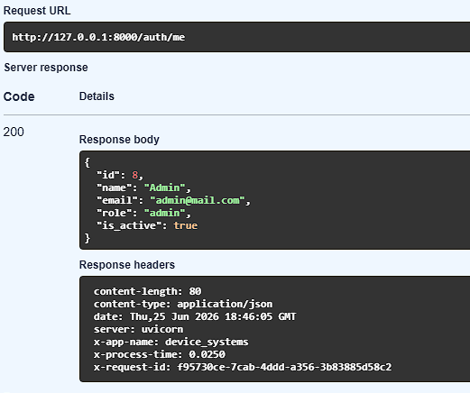 | GET /auth/me — Usuario autenticado con token válido |

### Protección de rutas
| # | Captura | Descripción |
|---|---------|-------------|
| 11 | 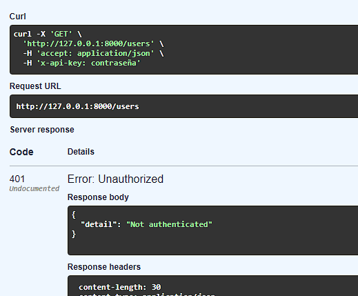 | GET /users sin token — Error 401 Unauthorized |
| 12 | 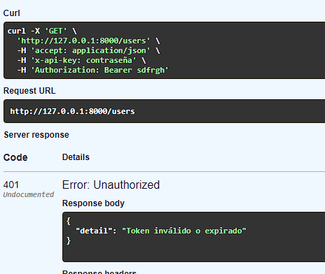 | GET /users con token falso — Error 401 Token inválido o expirado |
| 13 | 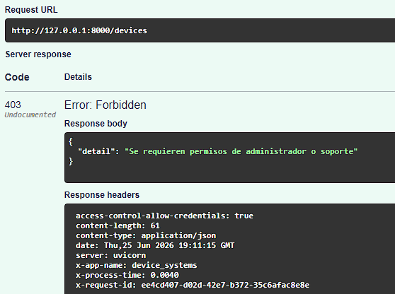 | POST /devices con rol user — Error 403 Forbidden |
| 14 | 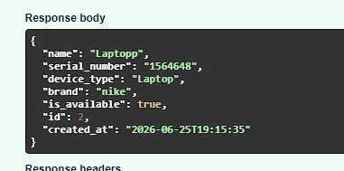 | POST /devices con rol admin — Creación exitosa 201 |
| 15 | 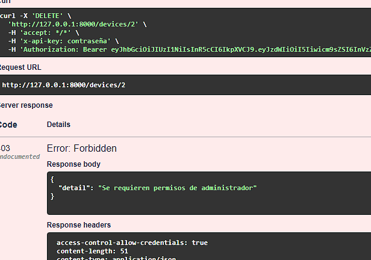 | DELETE /devices con rol no admin — Error 403 |

### Documentación y seguridad
| # | Captura | Descripción |
|---|---------|-------------|
| 16 | 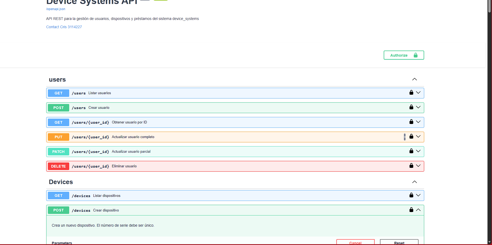 | Documentación interactiva con OAuth2 Bearer token |
| 17 | 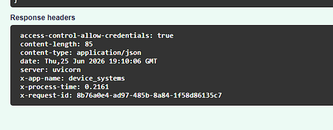 | Cabeceras personalizadas X-Request-ID, X-Process-Time, X-App-Name |
| 18 | 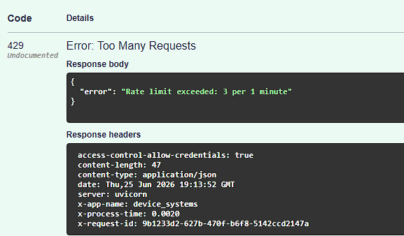 | Rate limiting — 429 Too Many Requests al exceder el límite |
| 19 | 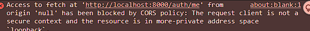 | Error CORS al hacer petición desde origen no autorizado |

---

## Reflexión sobre la importancia de la seguridad en APIs REST

La implementación de seguridad en esta API aborda múltiples capas de protección, cada una con un propósito específico:

**Hash de contraseñas:** Almacenar contraseñas en texto plano es una vulnerabilidad crítica. Usar `passlib` con `bcrypt` garantiza que aunque la base de datos se vea comprometida, las contraseñas originales no pueden recuperarse. Bcrypt además incluye un salt automático que hace que dos contraseñas iguales tengan hashes diferentes, protegiendo contra ataques de arcoíris.

**Rate limiting:** Sin limitación de peticiones, un atacante podría realizar miles de intentos de login por segundo (fuerza bruta) o saturar el servidor (DoS). SlowAPI permite definir límites por endpoint, mitigando estos riesgos y garantizando disponibilidad del servicio.

**CORS con orígenes explícitos:** Usar `allow_origins=["*"]` con `allow_credentials=True` es inválido según la especificación CORS y además permitiría a cualquier sitio web malicioso hacer peticiones autenticadas desde el navegador del usuario. Especificar orígenes concretos (como `localhost:5173` para desarrollo) restringe el acceso solo a los frontends autorizados.

**Middleware de trazabilidad:** Las cabeceras `X-Request-ID`, `X-Process-Time` y `X-App-Name` permiten correlacionar peticiones en logs distribuidos, medir el rendimiento de cada operación e identificar fácilmente el origen de errores. En producción, esto es esencial para depurar incidentes y auditar el uso de la API.

**JWT con control de roles:** Los tokens JWT permiten autenticación stateless (sin sesiones en servidor), ideal para APIs REST. Incluir el rol dentro del token permite aplicar control de acceso granular sin consultar la base de datos en cada petición. La expiración del token (60 minutos) limita la ventana de riesgo si un token es interceptado.

En conjunto, estas medidas forman una estrategia de defensa en profundidad donde cada capa cubre una amenaza diferente, y la ausencia de cualquiera de ellas debilitaría significativamente la seguridad general de la API.

---

## Link YouTube

[Ver video en YouTube](https://youtu.be/K4_wzxPOIMg)
