# Device Systems API

## Descripción de la aplicación
API REST para gestión de usuarios construida con **FastAPI** y **Pydantic v2**.
Permite crear, listar, filtrar, actualizar y eliminar usuarios con validación automática de datos y documentación interactiva.

## Tecnologías utilizadas
- **Python 3.10+**
- **FastAPI** — Framework web para construir APIs
- **Pydantic v2** — Validación de datos con `EmailStr` y `Field`
- **Uvicorn** — Servidor ASGI para ejecutar la aplicación
- **uv** — Gestor de dependencias y entornos virtuales

## Instalación de dependencias

```bash
# Inicializar el proyecto
uv init

# Agregar dependencias
uv add fastapi uvicorn pydantic[email]

# Sincronizar dependencias
uv sync
```

## Ejecución del servidor
```bash
uv run uvicorn app.main:app --reload
```
Servidor en http://127.0.0.1:8000 — Swagger en http://127.0.0.1:8000/docs

## Tabla de endpoints
| Método | Ruta | Descripción | Código |
|--------|------|-------------|--------|
| GET | /users | Lista todos los usuarios (filtros opcionales: ?role=, ?is_active=) | 200 |
| GET | /users/{user_id} | Obtiene un usuario por ID | 200 |
| POST | /users | Crea un nuevo usuario | 201 |
| PUT | /users/{user_id} | Actualiza completamente un usuario | 200 |
| PATCH | /users/{user_id} | Actualiza parcialmente un usuario | 200 |
| DELETE | /users/{user_id} | Elimina un usuario | 200 |

## Códigos de estado usados
| Código | Significado | Cuándo ocurre |
|--------|-------------|---------------|
| 200 | OK | Respuestas exitosas de GET, PUT, PATCH y DELETE |
| 201 | Created | Creación exitosa de un usuario (POST) |
| 400 | Bad Request | Email duplicado al crear o actualizar |
| 403 | Forbidden | API Key inválida o ausente (Depends) |
| 404 | Not Found | Usuario no encontrado por ID |
| 422 | Unprocessable Entity | Datos inválidos según validaciones de Pydantic |

## Estructura del proyecto

```
device_systems/
├── app/
│   ├── main.py                            # Punto de entrada de FastAPI
│   ├── data/users_db.py                   # Capa de datos (lista en memoria)
│   ├── schema/user_schema.py              # Modelos Pydantic con validaciones
│   ├── services/user_services.py          # Lógica de negocio y errores
│   ├── dependencies/user_dependencies.py  # Dependency Injection (Depends)
│   └── routes/user_routes.py              # Endpoints REST
├── images/                                # Capturas de evidencia
├── pyproject.toml                         # Dependencias del proyecto
├── uv.lock                                # Versiones exactas de dependencias
└── README.md
```

El proyecto sigue una arquitectura en capas:
- **data/** → almacenamiento (hoy en memoria, fácil de migrar a BD real)
- **schema/** → validación de datos de entrada/salida con Pydantic
- **services/** → lógica de negocio (validaciones, búsquedas, etc.)
- **dependencies/** → dependencias reutilizables con `Depends()`
- **routes/** → endpoints que conectan requests con services

## Ejemplos de peticiones y respuestas

### POST — Crear usuario
```bash
curl -X POST http://127.0.0.1:8000/users \
  -H "Content-Type: application/json" \
  -H "X-API-Key: Sena-CTMA-2024" \
  -d "{\"name\":\"Juan\",\"email\":\"juan@example.com\",\"role\":\"admin\",\"is_active\":true}"
```
```json
{"id":6,"name":"Juan","email":"juan@example.com","role":"admin","is_active":true}
```

### GET — Listar todos
```bash
curl -H "X-API-Key: Sena-CTMA-2024" http://127.0.0.1:8000/users
```

### GET — Filtrar por rol
```bash
curl -H "X-API-Key: Sena-CTMA-2024" "http://127.0.0.1:8000/users?role=admin"
```

### GET — Filtrar por activos
```bash
curl -H "X-API-Key: Sena-CTMA-2024" "http://127.0.0.1:8000/users?is_active=true"
```

### GET — Por ID
```bash
curl -H "X-API-Key: Sena-CTMA-2024" http://127.0.0.1:8000/users/1
```

### PUT — Actualizar usuario completo
```bash
curl -X PUT http://127.0.0.1:8000/users/1 \
  -H "Content-Type: application/json" \
  -H "X-API-Key: Sena-CTMA-2024" \
  -d "{\"name\":\"Alice Updated\",\"email\":\"alice@example.com\",\"role\":\"admin\",\"is_active\":false}"
```
```json
{"id":1,"name":"Alice Updated","email":"alice@example.com","role":"admin","is_active":false}
```

### PATCH — Actualizar parcialmente
```bash
curl -X PATCH http://127.0.0.1:8000/users/1 \
  -H "Content-Type: application/json" \
  -H "X-API-Key: Sena-CTMA-2024" \
  -d "{\"name\":\"Alice Modificada\"}"
```
```json
{"id":1,"name":"Alice Modificada","email":"alice@example.com","role":"admin","is_active":true}
```

### DELETE — Eliminar usuario
```bash
curl -X DELETE http://127.0.0.1:8000/users/1 \
  -H "X-API-Key: Sena-CTMA-2024"
```
```json
{"detail":"Usuario eliminado"}
```

## Capturas de Swagger UI

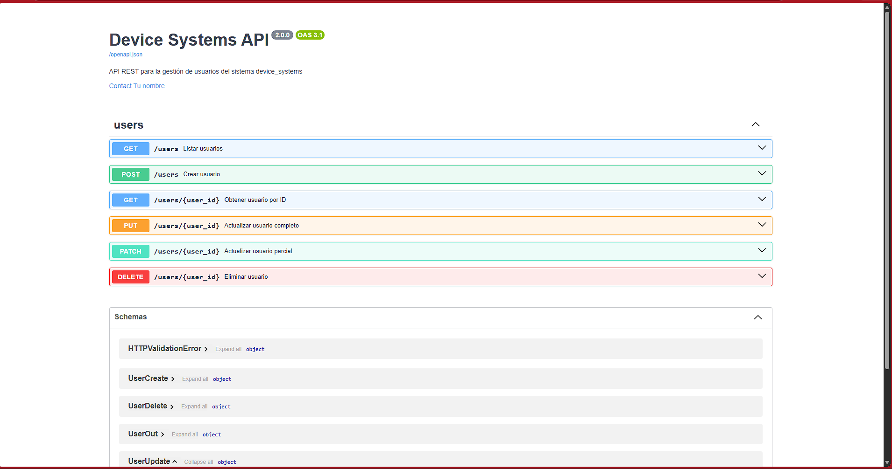

Documentación interactiva generada automáticamente por FastAPI en `/docs`. Permite probar cada endpoint directamente desde el navegador.

## Capturas de ReDoc

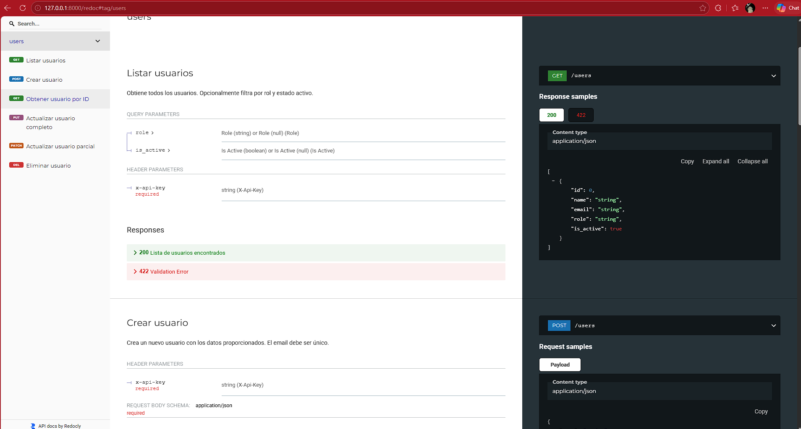

Documentación alternativa generada por FastAPI en `/redoc`. Interfaz de solo lectura más limpia y estructurada.

## Dependency Injection con Depends()

`Depends()` es un mecanismo de **inyección de dependencias** de FastAPI. Permite extraer lógica reutilizable (validaciones, autenticación) fuera de los endpoints.

### Implementación en el proyecto

Se implementaron dos dependencias en `app/dependencies/user_dependencies.py`:

```python
from fastapi import HTTPException, Header
from app.services import user_services as us


def get_user_or_404(user_id: int):
    """Obtiene usuario por ID o lanza 404 si no existe."""
    return us.get_user_by_id(user_id)


def verify_api_key(x_api_key: str = Header(...)):
    """Valida API Key en el header X-API-Key."""
    if x_api_key != "Sena-CTMA-2024":
        raise HTTPException(403, detail="API Key inválida. Use 'Sena-CTMA-2024'")
    return x_api_key
```

### ¿Cómo se usan?

**`verify_api_key`** se aplica a nivel de **router** — todos los endpoints la ejecutan automáticamente:

```python
router = APIRouter(tags=["users"], dependencies=[Depends(verify_api_key)])
```

**`get_user_or_404`** se aplica a nivel de **endpoint** — inyecta el resultado directamente:

```python
@router.get("/users/{user_id}")
def get_user(user: dict = Depends(get_user_or_404)):
    return user  # ← ya recibes el dict del usuario, sin buscar manualmente
```

### Flujo de validación en cadena

```
Request → ¿Header X-API-Key?
              │
              ▼
   1. verify_api_key (router)
      ├─ ¿Falta el header?       → 422 (FastAPI)
      ├─ ¿Key incorrecta?        → 403
      └─ ¿Key correcta?          → pasa
              │
              ▼
   2. get_user_or_404 (endpoint, solo en GET /users/{id})
      ├─ ¿Usuario existe?        → inyecta el dict
      └─ ¿No existe?             → 404
              │
              ▼
   3. Ejecuta el endpoint
```

### ¿Para qué sirve?
- **Autenticación**: validar tokens o API keys antes de cada request
- **Reutilización**: la misma dependencia se aplica a múltiples endpoints
- **Testing**: se puede sobrescribir la dependencia fácilmente en pruebas

## Explicación del manejo de errores

El proyecto maneja errores en dos capas:

### 1. Validación automática (422 — Pydantic)
FastAPI valida los datos de entrada automáticamente según los modelos de Pydantic. Si un campo no cumple las reglas (nombre muy corto, email inválido, rol no permitido), devuelve un error **422 Unprocessable Entity** sin necesidad de escribir código adicional.

```python
class UserBase(BaseModel):
    name: str = Field(min_length=3, max_length=30)  # ← validación automática
    email: EmailStr                                    # ← validación automática
    role: Literal["admin", "support", "user"]          # ← validación automática
```

### 2. Errores de negocio (400, 404 — HTTPException)
Los errores relacionados con la lógica de la aplicación se lanzan manualmente desde `services/user_services.py` usando `HTTPException`:

```python
# services/user_services.py

def get_user_by_id(user_id: int):
    for user in users_db:
        if user["id"] == user_id:
            return user
    raise HTTPException(404, detail="Usuario no encontrado")

def create_user(user: UserCreate):
    for existing in users_db:
        if existing["email"] == user.email:
            raise HTTPException(400, detail=f"El email {user.email} ya está registrado")
```

| Excepción | Causa |
|-----------|-------|
| 404 | El ID solicitado no existe en la base de datos |
| 400 | El email del nuevo usuario ya está registrado |

Esta separación mantiene la lógica de negocio independiente de la capa HTTP, permitiendo que los servicios puedan reutilizarse en otros contextos (CLI, tests, etc.).

## Capturas de evidencia

### Pruebas exitosas
| Captura | Descripción |
|---------|-------------|
|  | Servidor ejecutándose correctamente |
|  | GET /users — lista todos los usuarios |
|  | GET /users/1 — obtiene usuario por ID |
|  | GET /users?role=admin — filtra por rol |
|  | GET /users?is_active=true — filtra usuarios activos |
|  | GET /users?is_active=false — filtra usuarios inactivos |
|  | POST /users — creación exitosa de usuario |
| 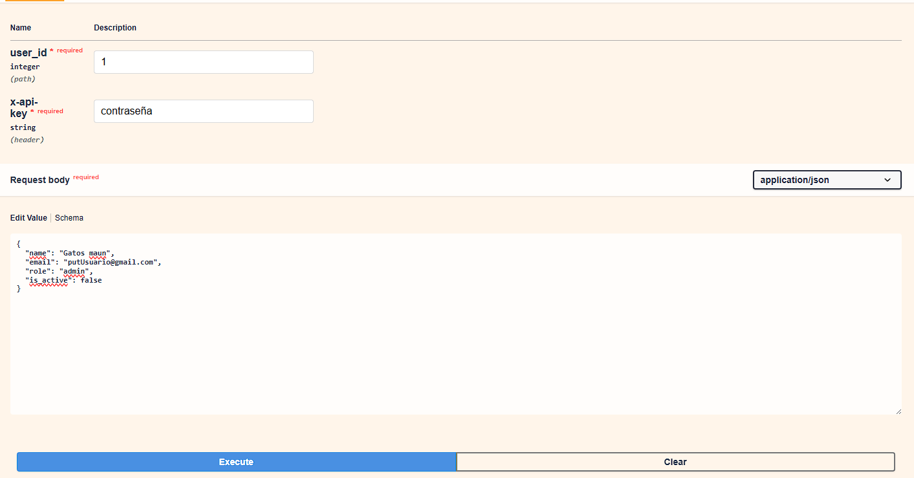 | PUT /users/1 — datos a enviar para actualizar |
| 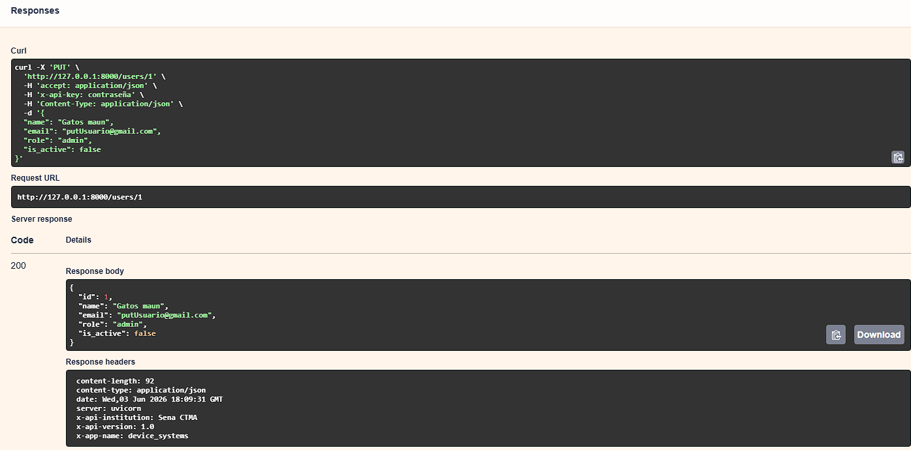 | PUT /users/1 — resultado de la actualización |
| 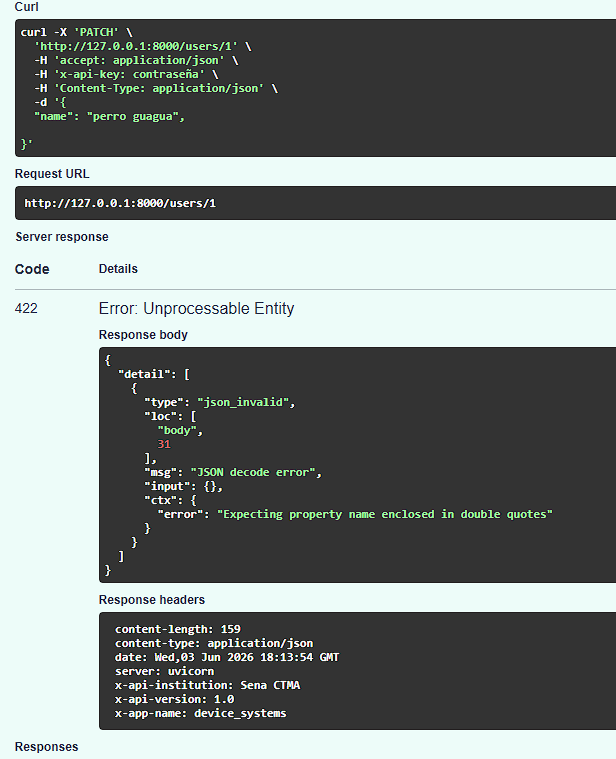 | PATCH /users/1 — actualización parcial |
| 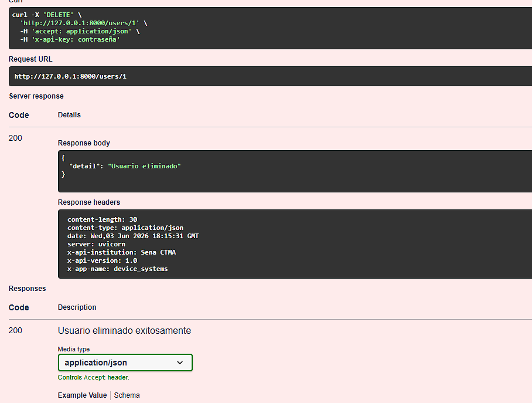 | DELETE /users/1 — usuario eliminado |

### Errores y validaciones
| Captura | Descripción |
|---------|-------------|
|  | POST /users — validación: nombre demasiado corto (< 3 caracteres) |
|  | POST /users — validación: correo electrónico inválido o vacío |
|  | POST /users — error 400: email ya registrado |
| 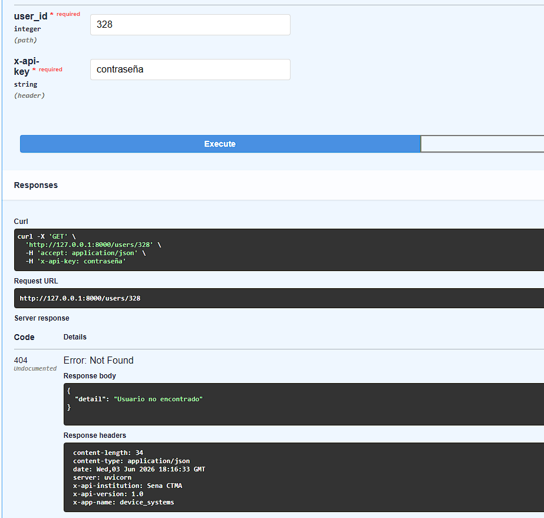 | GET /users/999 — error 404: usuario no encontrado |
| 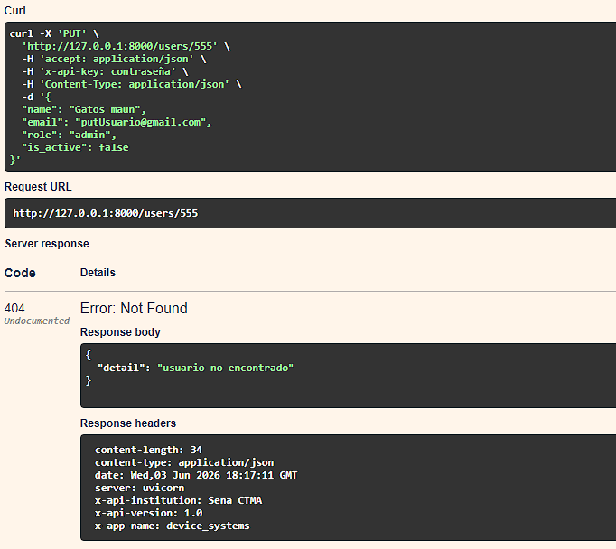 | PUT /users/999 — error 404: usuario no encontrado |
| 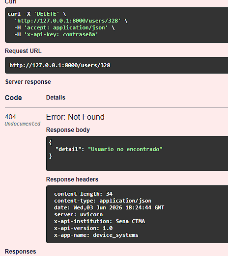 | DELETE /users/999 — error 404: usuario no encontrado |
| 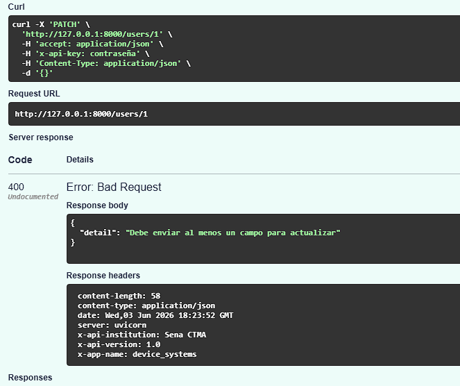 | PATCH /users/1 con {} — error 400: debe enviar al menos un campo |
| 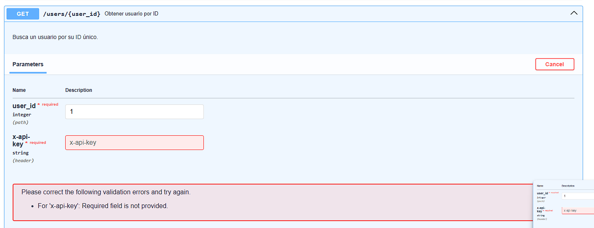 | GET /users sin header X-API-Key — error 422 |
| 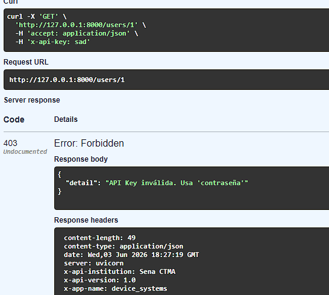 | GET /users con API Key falsa — error 403 |

---

## Reflexión final

A lo largo de este proyecto se evolucionó desde una API básica con pocos endpoints hasta una API REST completa con separación de responsabilidades en capas (data, schema, services, dependencies, routes). Se implementó el CRUD completo del recurso users (GET, POST, PUT, PATCH, DELETE) con validaciones automáticas mediante Pydantic v2, manejo de errores HTTP con respuestas claras, y autenticación simulada mediante Dependency Injection con `Depends()`.

La documentación interactiva se generó automáticamente con Swagger UI y ReDoc, permitiendo probar y visualizar cada endpoint sin configuración adicional. La separación en capas facilita el mantenimiento, testing, y futuras migraciones (por ejemplo, de una lista en memoria a una base de datos real).
