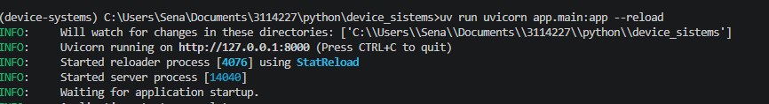
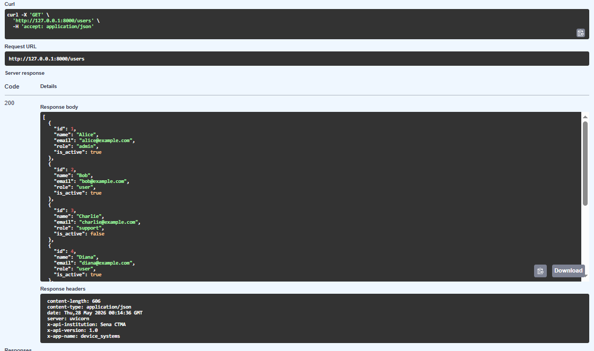
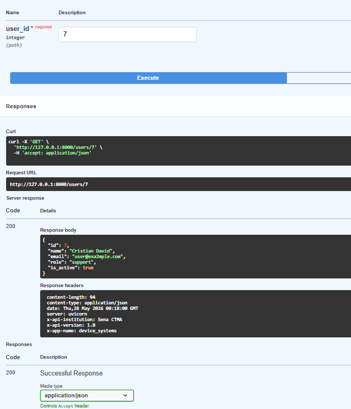
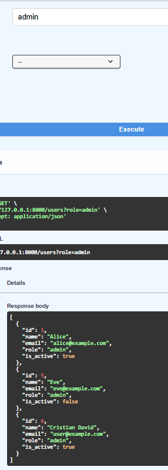
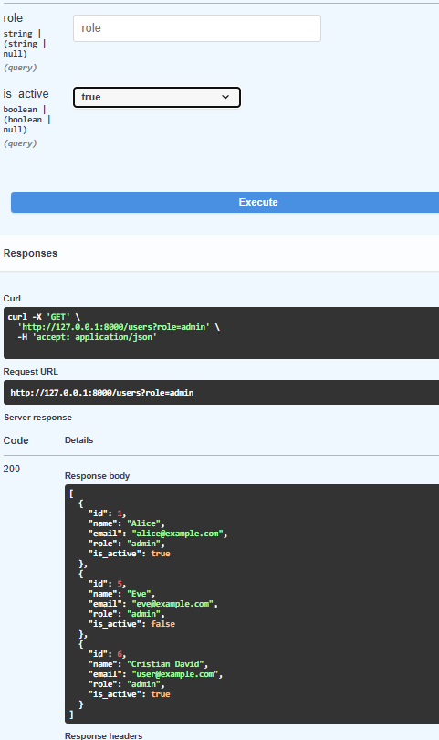
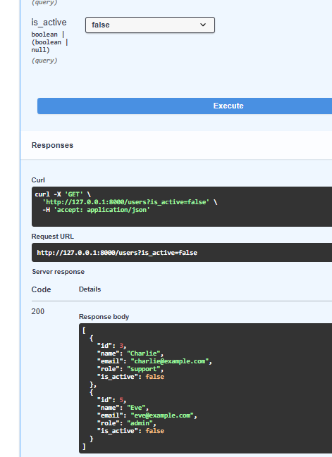
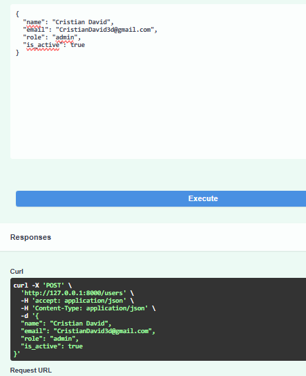
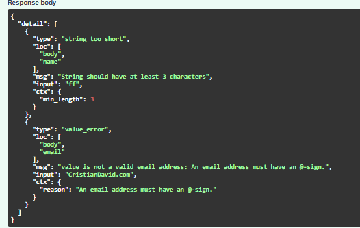
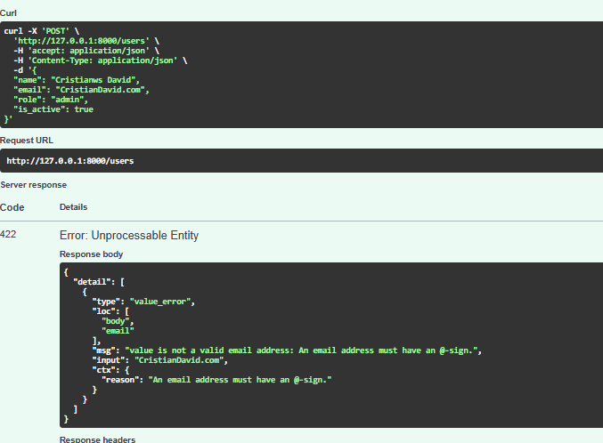
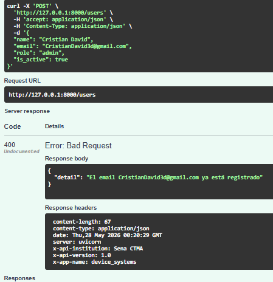

# Device Systems API

## Descripción de la aplicación
API REST para gestión de usuarios construida con **FastAPI** y **Pydantic v2**.
Permite crear, listar, filtrar, actualizar y eliminar usuarios con validación automática de datos y documentación interactiva.

## Tecnologías utilizadas
- **Python 3.10+**
- **FastAPI** — Framework web para construir APIs
- **Pydantic v2** — Validación de datos con `EmailStr` y `Field`
- **Uvicorn** — Servidor ASGI para ejecutar la aplicación
- **uv** — Gestor de dependencias y entornos virtuales

## Instalación de dependencias

```bash
# Inicializar el proyecto
uv init

# Agregar dependencias
uv add fastapi uvicorn pydantic[email]

# Sincronizar dependencias
uv sync
```

## Ejecución del servidor
```bash
uv run uvicorn app.main:app --reload
```
Servidor en http://127.0.0.1:8000 — Swagger en http://127.0.0.1:8000/docs

## Tabla de endpoints
| Método | Ruta | Descripción | Código |
|--------|------|-------------|--------|
| GET | /users | Lista todos los usuarios (filtros opcionales: ?role=, ?is_active=) | 200 |
| GET | /users/{user_id} | Obtiene un usuario por ID | 200 |
| POST | /users | Crea un nuevo usuario | 201 |
| PUT | /users/{user_id} | Actualiza completamente un usuario | 200 |
| PATCH | /users/{user_id} | Actualiza parcialmente un usuario | 200 |
| DELETE | /users/{user_id} | Elimina un usuario | 200 |

## Códigos de estado usados
| Código | Significado | Cuándo ocurre |
|--------|-------------|---------------|
| 200 | OK | Respuestas exitosas de GET, PUT, PATCH y DELETE |
| 201 | Created | Creación exitosa de un usuario (POST) |
| 400 | Bad Request | Email duplicado al crear o actualizar |
| 404 | Not Found | Usuario no encontrado por ID |
| 422 | Unprocessable Entity | Datos inválidos según validaciones de Pydantic |

## Ejemplos de peticiones y respuestas

### POST — Crear usuario
```bash
curl -X POST http://127.0.0.1:8000/users \
  -H "Content-Type: application/json" \
  -d "{\"name\":\"Juan\",\"email\":\"juan@example.com\",\"role\":\"admin\",\"is_active\":true}"
```
```json
{"id":6,"name":"Juan","email":"juan@example.com","role":"admin","is_active":true}
```

### GET — Listar todos
```bash
curl http://127.0.0.1:8000/users
```

### GET — Filtrar por rol
```bash
curl "http://127.0.0.1:8000/users?role=admin"
```

### GET — Filtrar por activos
```bash
curl "http://127.0.0.1:8000/users?is_active=true"
```

### GET — Por ID
```bash
curl http://127.0.0.1:8000/users/1
```

### PUT — Actualizar usuario completo
```bash
curl -X PUT http://127.0.0.1:8000/users/1 \
  -H "Content-Type: application/json" \
  -d "{\"name\":\"Alice Updated\",\"email\":\"alice@example.com\",\"role\":\"admin\",\"is_active\":false}"
```
```json
{"id":1,"name":"Alice Updated","email":"alice@example.com","role":"admin","is_active":false}
```

### PATCH — Actualizar parcialmente
```bash
curl -X PATCH http://127.0.0.1:8000/users/1 \
  -H "Content-Type: application/json" \
  -d "{\"name\":\"Alice Modificada\"}"
```
```json
{"id":1,"name":"Alice Modificada","email":"alice@example.com","role":"admin","is_active":true}
```

### DELETE — Eliminar usuario
```bash
curl -X DELETE http://127.0.0.1:8000/users/1
```
```json
{"detail":"Usuario eliminado"}
```

## Capturas de Swagger UI
*Agregar aquí las capturas de pantalla de la documentación interactiva en /docs*

## Explicación del uso de Depends()

`Depends()` es un mecanismo de **inyección de dependencias** de FastAPI. Permite extraer lógica reutilizable (validaciones, autenticación, conexiones a BD) fuera de los endpoints.

### Ejemplo conceptual

```python
from fastapi import Depends

def verify_api_key(x_api_key: str = Header(...)):
    if x_api_key != "secret-key":
        raise HTTPException(403, detail="Acceso denegado")
    return x_api_key

@router.get("/users")
def list_users(
    api_key: str = Depends(verify_api_key),  # ← se ejecuta antes del endpoint
    role: str | None = Query(None),
):
    return us.get_users(role, None)
```

FastAPI ejecuta `verify_api_key()` automáticamente antes de entrar al endpoint. Si la función lanza una excepción, el endpoint nunca se ejecuta. Si retorna un valor, ese valor se inyecta en el parámetro `api_key`.

### ¿Para qué sirve?
- **Autenticación**: validar tokens o API keys antes de cada request
- **Conexiones a BD**: obtener una sesión de base de datos
- **Parámetros comunes**: agrupar query params que se repiten en varios endpoints
- **Testing**: se puede sobrescribir la dependencia fácilmente en pruebas

En este proyecto no se implementó `Depends()` porque las validaciones son simples y directas, pero es la herramienta ideal para cuando la lógica crezca (ej: agregar autenticación JWT).

## Explicación del manejo de errores

El proyecto maneja errores en dos capas:

### 1. Validación automática (422 — Pydantic)
FastAPI valida los datos de entrada automáticamente según los modelos de Pydantic. Si un campo no cumple las reglas (nombre muy corto, email inválido, rol no permitido), devuelve un error **422 Unprocessable Entity** sin necesidad de escribir código adicional.

```python
class UserBase(BaseModel):
    name: str = Field(min_length=3, max_length=30)  # ← validación automática
    email: EmailStr                                    # ← validación automática
    role: Literal["admin", "support", "user"]          # ← validación automática
```

### 2. Errores de negocio (400, 404 — HTTPException)
Los errores relacionados con la lógica de la aplicación se lanzan manualmente desde `services/user_services.py` usando `HTTPException`:

```python
# services/user_services.py

def get_user_by_id(user_id: int):
    for user in users_db:
        if user["id"] == user_id:
            return user
    raise HTTPException(404, detail="Usuario no encontrado")

def create_user(user: UserCreate):
    for existing in users_db:
        if existing["email"] == user.email:
            raise HTTPException(400, detail=f"El email {user.email} ya está registrado")
```

| Excepción | Causa |
|-----------|-------|
| 404 | El ID solicitado no existe en la base de datos |
| 400 | El email del nuevo usuario ya está registrado |

Esta separación mantiene la lógica de negocio independiente de la capa HTTP, permitiendo que los servicios puedan reutilizarse en otros contextos (CLI, tests, etc.).

## Capturas de evidencia

### Pruebas exitosas
| Captura | Descripción |
|---------|-------------|
|  | Servidor ejecutándose correctamente |
|  | GET /users — lista todos los usuarios |
|  | GET /users/1 — obtiene usuario por ID |
|  | GET /users?role=admin — filtra por rol |
|  | GET /users?is_active=true — filtra usuarios activos |
|  | GET /users?is_active=false — filtra usuarios inactivos |
|  | POST /users — creación exitosa de usuario |

### Errores y validaciones
| Captura | Descripción |
|---------|-------------|
|  | POST /users — validación: nombre demasiado corto (< 3 caracteres) |
|  | POST /users — validación: correo electrónico inválido o vacío |
|  | POST /users — error 400: email ya registrado |
